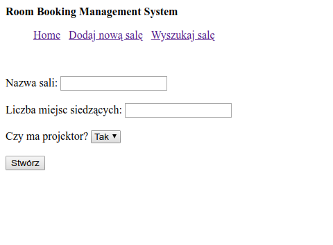

# Room Booking Management System
1-day bootcamp workshop. A simple web application for booking rooms, using Python, Django and SQL. Performed after a few days of learning Django, without templates, generic forms or mixins.

# Main features
* Room booking
* Room adding, modification, deletion
* View one room or all
* Search using parts of words, minimal number of seats, dates, availability of a projector

# Sample screenshots

Room List (Index)

New Room

Room Reservation

Search and Results

# Author
Bartosz Wójcik
bartosz.wojcik@bartvessh.com
